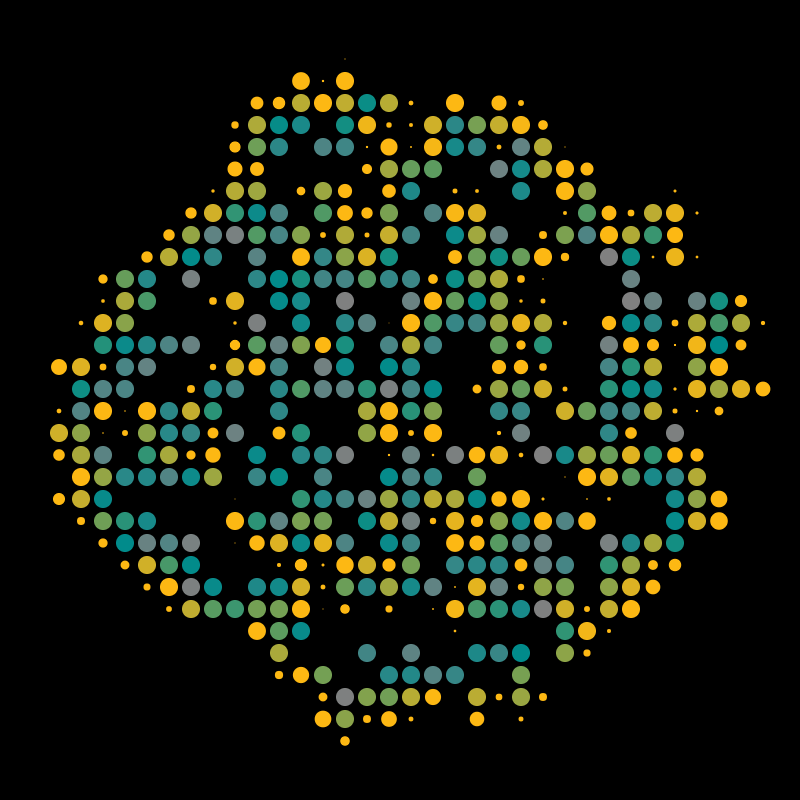

<h1 align="center">PHYSARUM - GENERATIVE ART</h1>

a p5.js-based generative art animation inspired and named after physarum (slime mold) growth patterns. creates organic, spreading formations of circles with dynamic color transitions and spawning behavior.

  

## ruleset

- **canvas**: the drawing area is a square, and circles always stay fully inside it.
- **circle placement**: new circles appear next to their parent, moving in one of the four main directions (up, down, left, or right).
- **growth**: circles smoothly grow from nothing to their full size over a short, random time.
- **color lifecycle**: each circle changes color as it ages, starting bright, then shifting to cooler tones, and finally fading out.
- **lifetime**: after reaching full size, circles remain for a while before disappearing.
- **spawning**: once mature, a circle may create one or two new circles in nearby empty spots, if there is space.
- **collision avoidance**: circles only appear where there is no overlap with others.

## how to run

1. open `physarum.html` in any modern web browser
2. the animation starts automatically with a single circle in the center
3. watch as the organic pattern emerges and evolves

## technical details

### canvas settings
- resolution: 800x800 pixels
- circle size: 9 pixels diameter
- spacing gap: 2 pixels between circles

## dependencies

- p5.js library (loaded via cdn)
- modern web browser with html5 canvas support