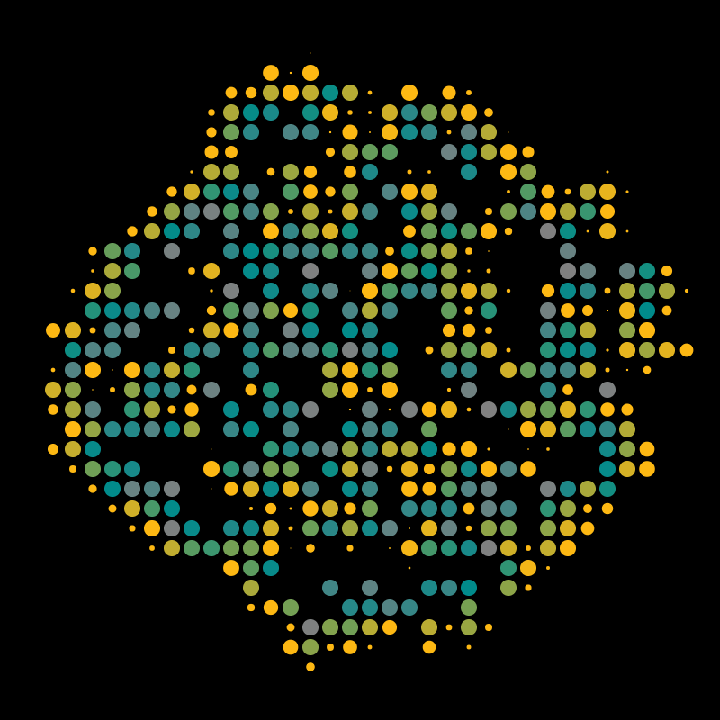

<!-- PURPOSE: main project readme.md. -->

<h1 align="center">PHYSARUM - GENERATIVE ART</h1>

 

  
  
  

A p5.js-based generative art animation inspired by and named after Physarum (slime mold) growth patterns. Creates organic, spreading formations of circles with dynamic color transitions and spawning behavior.

 

  

 

## PROTOTYPING / WORK IN PROGRESS (⚠️)

This software is a work in progress and currently in its prototyping phase. It is not intended for production use. Errors may occur, features may change, and documentation may be fragmented or incomplete. During the prototyping phase, all support inquiries about this software will be ignored.

## Ruleset

| Rule | Description |
|------|-------------|
| **Canvas** | The drawing area is a square, and circles always stay fully inside it. |
| **Circle placement** | New circles appear next to their parent, moving in one of the four main directions (up, down, left, or right). |
| **Growth** | Circles smoothly grow from nothing to their full size over a short, random time. |
| **Color lifecycle** | Each circle changes color as it ages, starting bright, then shifting to cooler tones, and finally fading out. |
| **Lifetime** | After reaching full size, circles remain for a while before disappearing. |
| **Spawning** | Once mature, a circle may create one or two new circles in nearby empty spots, if there is space. |
| **Collision avoidance** | Circles only appear where there is no overlap with others. |

## How to Run

1. Open `physarum.html` in any modern web browser
2. The animation starts automatically with a single circle in the center
3. Watch as the organic pattern emerges and evolves

## Technical Details

### Canvas Settings
- Resolution: 800x800 pixels
- Circle size: 9 pixels diameter
- Spacing gap: 2 pixels between circles

## Dependencies

- p5.js library (loaded via CDN)
- Modern web browser with HTML5 canvas support

## COPYRIGHT, CONTEXT, LICENSE & LIMMITATIONS

Copyright 2025 - Robin Winkelmann | robinRx | rx-inference

This repository, its software and all other associated material is part of a collection of other software and generative art from this developer and licensed under Apache License, Version 2.0 (the "License").
You may not use this file except in compliance with the License.
See the [LICENSE](https://github.com/robinrx/generative_art/blob/main/LICENSE) in the root of this project for details.
You may obtain a copy of the License at http://www.apache.org/licenses/LICENSE-2.0.

Unless required by applicable law or agreed to in writing, software
distributed under the License is distributed on an "AS IS" BASIS,
WITHOUT WARRANTIES OR CONDITIONS OF ANY KIND, either express or implied.
See the License for the specific language governing permissions and
limitations under the License.